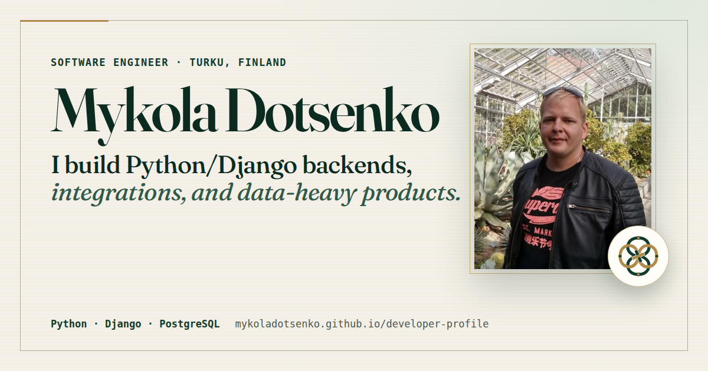

# Developer Profile — Mykola Dotsenko

My public software profile and recruiter CV.

**Live:** https://mykoladotsenko.github.io/developer-profile/

[Resume](https://mykoladotsenko.github.io/developer-profile/resume.html) ·
[LinkedIn](https://www.linkedin.com/in/mykola-dotsenko/) ·
[GitHub](https://github.com/MykolaDotsenko)



I work mostly with Python/Django backends, PostgreSQL, external integrations, search, documents, and data that has to stay consistent across more than one system. I also do frontend work with React, Next.js, TypeScript, and HTMX when it is part of the same feature.

At Bo, some of my current work includes Kivi, OviPro, and HubSpot CRM flows at roughly 200k-contact scale, identity matching, document synchronization, production debugging, and query performance work.

Before software I spent more than eight years in agriculture, greenhouse and food production, accounting, sales, and customer-facing roles. That is useful context for AgTech and other operational products.

## Projects on the site

### [Cultural Currency Converter](https://github.com/MykolaDotsenko/cultural-currency-converter)

**Python · Django · PostgreSQL · HTMX · Redis**

A travel-money app with current and historical FX rates. The main implementation problem is keeping source and effective-date meaning correct while still giving the user a useful result when optional providers fail.

### [DomoNest](https://github.com/MykolaDotsenko/domonest)

**Python · Django · Wagtail · PostgreSQL**

A household app connecting pantry, recipes, shopping, and recurring tasks. I use database constraints and derived state so those features do not drift apart.

### [Turku Departures](https://github.com/MykolaDotsenko/foli-live-departures)

**React · Vite · GTFS/SIRI · PWA**

A Turku transit PWA that deals with stale live data, repeated stops, poor GPS, offline use, and the difference between live and scheduled departure information.

[Live demo](https://mykoladotsenko.github.io/foli-live-departures/)

### [JunaLippu](https://github.com/MykolaDotsenko/JunaLippu)

**Next.js · TypeScript · tRPC · Prisma**

A Finnish rail-booking demo with segment-level seat inventory. Database rules protect against concurrent overbooking.

### [Shopping Budget Companion](https://github.com/MykolaDotsenko/shopping-budget-companion)

**React · TypeScript · Zod · PWA**

A local-first shopping budget app. Money is stored as integer minor units, saved data is versioned, and camera/OCR recognition can suggest values but cannot silently add them to the cart.

[Live demo](https://mykoladotsenko.github.io/shopping-budget-companion/)

### [RPS League — Reaktor](https://github.com/MykolaDotsenko/reaktor-rps-league)

**Next.js · TypeScript · Zod**

A data-normalization exercise built around a difficult legacy API: pagination, malformed records, duplicates, rate limits, and inconsistent payloads.

[Live demo](https://reaktor-rps-zeta.vercel.app/)

### [Tradeoff — Decision Lab](https://github.com/MykolaDotsenko/tradeoff-decision-lab)

**React · TypeScript · Zod · Vercel**

A comparison tool where score, evidence confidence, and sensitivity stay separate. AI can help turn a rough description into inputs, but the ranking is deterministic.

[Live demo](https://tradeoff-decision-lab.vercel.app/)

### [DayDock](https://github.com/MykolaDotsenko/daydock)

**React · TypeScript · Local-first**

A browser-only workday planner for capture, priorities, focus blocks, follow-ups, and daily review.

[Live demo](https://mykoladotsenko.github.io/daydock/)

## About this site

The site is plain HTML and CSS on purpose. There is no application state or interaction here that needs a frontend framework.

The repository contains:

- the public profile page;
- a separate print-friendly resume;
- responsive CSS;
- social preview metadata;
- a small local-link validation script;
- GitHub Actions checks for HTML and local references.

## Local preview

```bash
python -m http.server 8000
```

Open:

```text
http://127.0.0.1:8000/
```

Resume:

```text
http://127.0.0.1:8000/resume.html
```

## Author

**Mykola Dotsenko**  
Software Engineer — Python/Django · Backend · Data · Integrations
